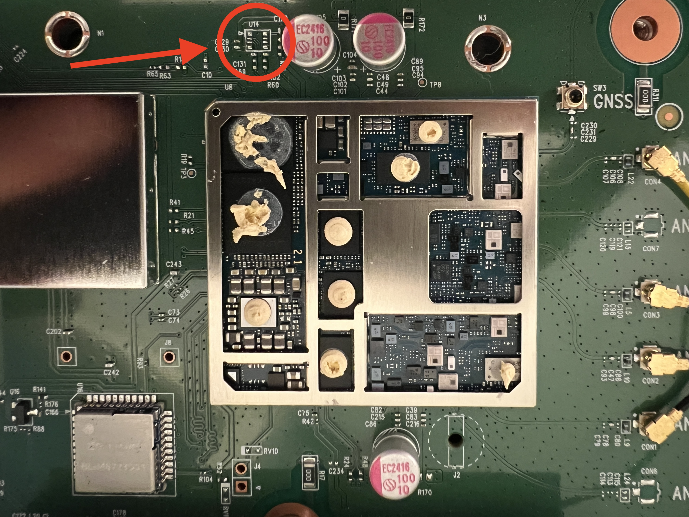
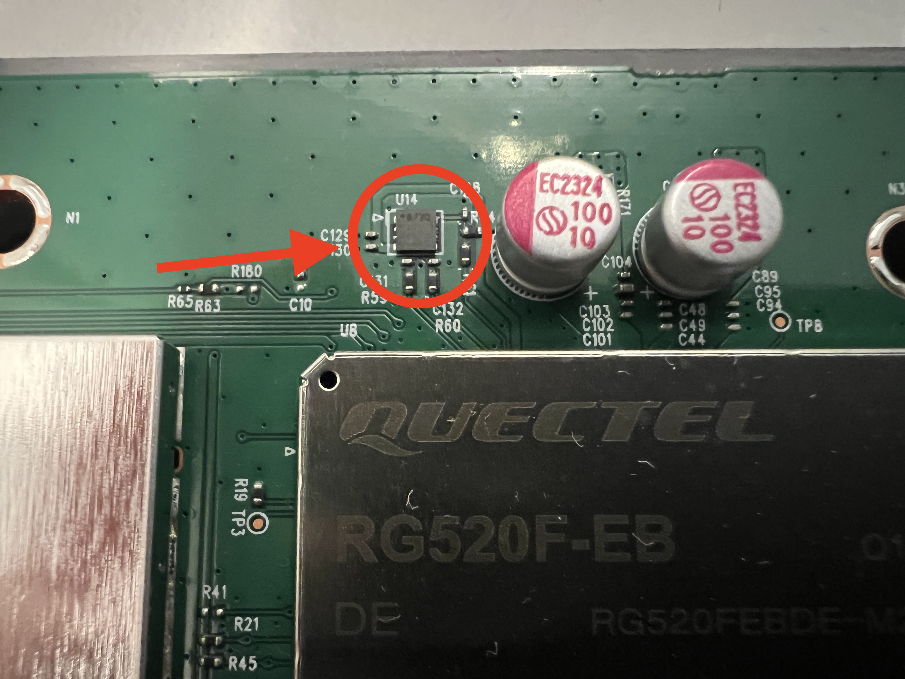
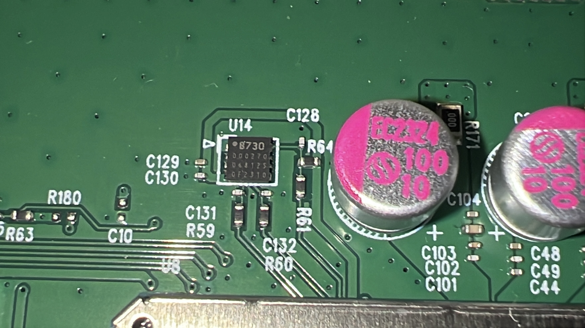

# Zyxel NR7302 Findings 

This is a collection of firmware- and hardware-related findings for the Zyxel NR7302 router. Most of these findings could also be applied to the NR7301 and NR7303.


[](https://www.buymeacoffee.com/ohne)

## Admin & Root Password Retrieval

If you lost or never received the admin password for the devices, there is a solution to retrieve it again by editing the firmware files and flash these files with zycast

[Firmware-Editing](firmware/README.md)

## Flash a Firmware with Zycast

If you soft-bricked your device or you don't have access to SSH/WebUI you can flash a valid firmware file via zycast multicast flash method. A detailed description is here:

[Zycasting](usb/README.md)

## Adding USB to access ADB and Qualcomm DIAG

Since you can not access the EFS system of the modem you need to access these files via QPST/EFS Explorer. Therefore you need to access and enable the DIAG mode and add an USB port to the device.

[USB-Functionality](usb/README.md)

## Missing eSIM Functionality for DTAG devices

Devices without eSIM functionality, such as DTAG devices, have the modem version RG520F-EB Q1-C0752 installed. These devices do not have the eUICC chip for eSIM functionality. It is not soldered in.



Devices that have eSIM functionality, such as those from A1 Austria or Telenor Norway, have the corresponding chip. The modem revisions installed are version: RF520F-EB Q1-C1751.





It may be possible to solder in an eUICC chip. One possible candidate for retrofitting eSIM functionality on the hardware side would be the ST4SI2M0020TPIFW chip.


## Telenor Devices

They have their own section... The devices are practically unmanageable by the user. In the delivery state and after resetting the devices, a configuration is imported that leaves the 'BootFromFactoryDefault' option set to true. This deletes any configuration changes when booting. However, as the devices have a USB port, the configuration can easily be changed via ADB Shell. Telenor has come up with even more gifts for its customers which you can edit to gain permanent access. 
You have to change several setting in /xdata/zcfg_config.json. 

**First of course you have to change the BootFromFactoryDefault setting to false!**
- The DHCP server is deactivated. To activate, set Enable to true:
    ```"DHCPv4":{
            "Server":{
                "Enable":true,```

- Remote management only works on the WAN interfaces, i.e. no Web UI and no SSH etc. To be able to access via the LAn interface, change the mode to LAN_ONLY and DisableSshPasswordLogin to false:
```{
        "Name":"HTTPS",
        "Enable":true,
        "Protocol":6,
        "Port":443,
        "Mode":"LAN_ONLY",
        "TrustAll":true
      },
```
```
      {
        "Name":"SSH",
        "Enable":true,
        "Protocol":6,
        "Port":22022,
        "Mode":"LAN_ONLY",
        "TrustAll":true,
        "DisableSshPasswordLogin":false
      },
```

The Telenor devices receive updates via a special Telenor server. Updates are only made available if the router is logged into the Telenor network. If you are running a Telenor NR7302 device without a telenor IP, you could consider cross-flashing the device to a more customer-friendly version. 


## Cross-Flashing

Warning: These steps are WIP. It must be expected that attempting to flash a device from one firmware to another may result in a soft or hard brick. No responsibility is accepted for this.

All NR7302 devices can also be flashed with firmware from other providers. However, if certain things are not taken into account, this can result in a soft brick, which in the worst case may require soldering a USB port.

### Example: Telenor 2 DTAG (Deutsche Telekom):
- Gain Root Access + activate supervisor account in zcfg_config.json (Root Password == Supervisor Password)
- Login into Web UI with supervisor account 
- Navigate to: Maintanance -> Backup/Restore -> ROM-D
- IMPORTANT: Backup ROM-D Configuration (eID is saved inside of this file)
- Clear ROM-D Configuration
- Navigate: Maintanance -> Firmware Upgrade 
- IMPORTANT: Activate/Check "Restore Default Settings After Firmware Upgrade"
- Upload new Firmware File (Does not work in Apple Safari)
- Wair for Reboot: LEDs will flash red, green, yellow