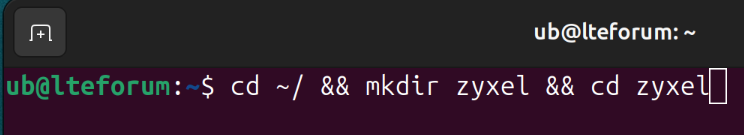
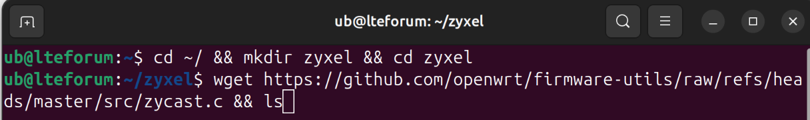
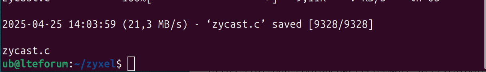
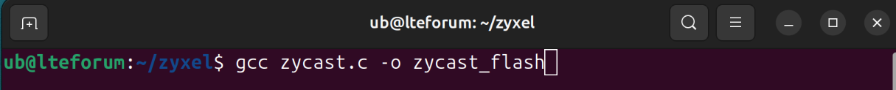
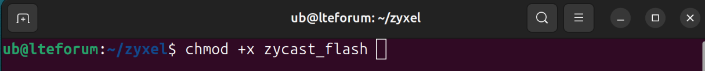
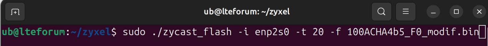
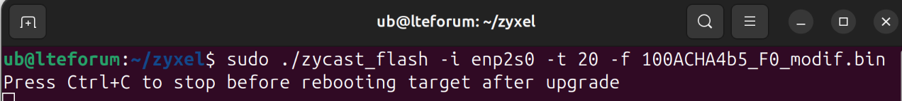

# Flashing Firmwares on non-acceptable or soft-bricked devices

Instructions and findings by Chris K. / xpla@lteforum.at

## How-To zycast

## Obtain & compile zycast
1. Open a Terminal (non-root) and paste the following commands
    - ``cd ~/ && mkdir zyxel && cd zyxel`` 
    - ``wget https://github.com/openwrt/firmware-utils/raw/refs/heads/master/src/zycast.c && ls`` 
2. Your output should look like this
    - zycast.c 
3. Compile Zycast
    - ``gcc zycast.c -o zycast_flash`` 
4. You may need to install the build-essential package
    - ``sudo apt install build-essential``
5. If you've compiled zycast_flash successfully, issue the following command
    - ``chmod +x zycast_flash`` 

> The next step assumes that you've already built your modified firmware <<<

## Flash the modified firmware with zycast

1. Set a static IP of your LAN-Interface via one of the methods
    - https://greenwebpage.com/community/how-to-set-static-ip-address-on-ubuntu-24-04/
    - Use the following parameters
        Address:	192.168.1.4
        Netmask:	255.255.255.0
        Gateway:	192.168.1.1
2. Note the name of the interface!
3. Copy the modified firmware in the directory of zycast
    - ``cp [path to modified firmware/firmware.bin] ~/zyxel``

> It is recommended, that the Zyxel-Router and your computer are connected via a switch.
> Connecting it directly via the PoE-Injector might work, but more often not.
> Also make sure, that the devices are the only ones connected to the switch.<<<

> IMPORTANT: The Zyxel-Router must be powered off till instructed otherwise 

## Flash the firmware
1. Run command: ``sudo ./zycast_flash -i enp2s0 -t 20 -f 100ACHA4b5_F0_custom_for_router.bin`` 
   - IMPORTANT: Replace "enp2s0" with the name of your LAN Interface
   - Replace 100ACHA4b5_F0_custom_for_router.bin with the name of your modified firmware
   - The output should look like this: 

2. Now power-on your Zyxel-Router by connecting a PoE-Source <<<
   - The router will start its boot process and must enter the following state
   - LEDs are blinking one after another in orange
   - After some time, both LEDs are blinking orange more or less simultaneously
   - Grab a coffee, the process can take one to two hours
   - After the firmware has been flashed, the router will switch both LEDs to constant green

3. Congratulations, you've successfully flashed the modified firmware
4. Exit the zycast on your computer by pressing CTRL+C
5. Spin-Up the Webserver to receive the encrypted passwords

* https://github.com/openwrt/firmware-utils/blob/master/src/zycast.c

